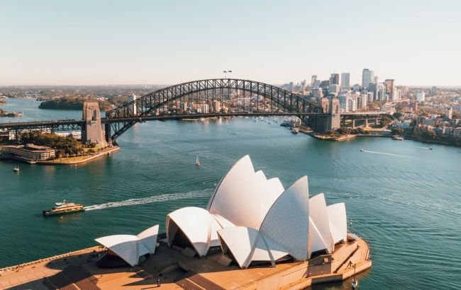

# Мой отпуск

## Локация
Австралия – это страна, занимающая одноименный материк, который омывается Индийским и Тихим океанами. На побережьях континента находятся такие крупные города, как Сидней, Брисбен, Мельбурн, Перт и Аделаида. Столица Австралии – Канберра – расположена вдали от моря. Главными достопримечательностями страны являются Сиднейский оперный театр, Большой Барьерный риф и аутбэк – обширная пустынная местность. Также интересна фауна Австралии: здесь обитают уникальные виды животных, например кенгуру и утконосы.
---

## Планы
1. Прлет
2. Заселение
3. Отдых
4. Поход по достопримечатеностям
---

## Фото

---

## Впечатления
**_Мною были пройдены все маршруты и я остался доволен._**